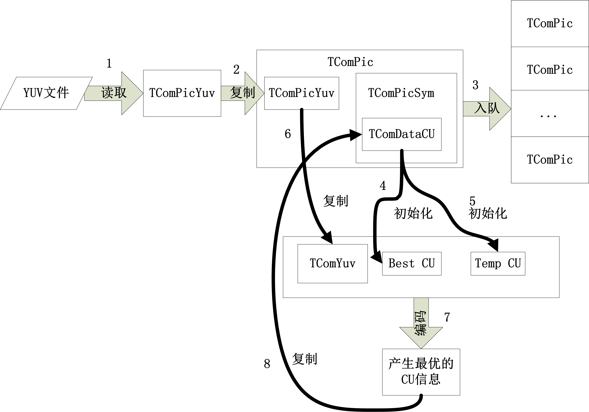
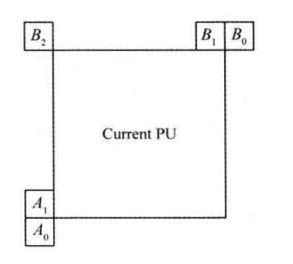
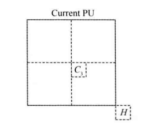

# HM代码阅读

## 关键类的说明

### 各个类之间的关系图



### TComDataCU


## 帧间预测

### Void TEncSearch::xEstimateMvPredAMVP

```c++

  Void TComDataCU::fillMvpCand ( const UInt partIdx, 
                                const UInt partAddr, 
                                const RefPicList eRefPicList, 
                                const Int refIdx, 
                                AMVPInfo* pInfo ) const
  {}
```

  该函数用于填充AMVP模式的MV候选列表（两个），填充规则如下

1.  空域候选（5选1）

     

     ​	从当前PU的 **左侧** 和 **上方** 各选择一个。

     ​	**左侧**的选择顺序为 $A_0 \rightarrow A_1 \rightarrow scaled\ A_0 \rightarrow scaled\ A_1$

     ​	**上方** $B_0 \rightarrow B_1 \rightarrow B_2 ( \rightarrow scaled\ B_0 \rightarrow scaled\ B_1 \rightarrow scaled\ B_2)$

     * scaled

       尺缩比例需要根据 **当前块与其参考帧**(td) 以及 **参考块与其参考帧** (tb)的距离来确定，即 $curMV = \frac{td}{tb}colMV$

     - 终止条件

       如果第一个就可用则选择它，不用考虑剩余部分

     - 矩形划分需要注意

       

       对于(a)来说，$PU_2$的候选列表不能存在$A_1$，否则可能与不划分的情况重合

2.  时域候选（与Merge类似，2选1）

     

     ​	顺序为 $scaled\ H \rightarrow scaled\ C_3$
### 运动搜索
对于色度分量没有额外进行运动搜索，**使用亮度分量的MV**，只是在运动补偿的时候进行了插值以便求出残差

## 调色板模式 (Palette Mode)
### 涉及到的开关变量
``` c++
  ("PaletteMode", m_usePaletteMode, false, "Enable the palette mode (not valid in V1 profiles")
  ("PaletteMaxSize", m_paletteMaxSize, 63u, "Maximum palette size")
  ("PaletteMaxPredSize", m_paletteMaxPredSize, 128u, "Maximum palette predictor size")
  ("PalettePredInSPSEnabled", m_palettePredInSPSEnabled, false, "Transmit palette predictor in SPS")
  ("PalettePredInPPSEnabled", m_palettePredInPPSEnabled, false, "Transmit palette predictor in PPS")
```

### 一些变量

| 变量名                        | 含义                                                         |
| ----------------------------- | ------------------------------------------------------------ |
| `m_indError[pos][paletteIdx]` | `pos`处使用调色板`paletteIdx`产生的SSE<br />**注意** `m_indError[pos]`的长度为`MAX_PALETTE_SIZE+1`<br />`m_indError[pos][MAX_PALETTE_SIZE-1]`记录了使用Escape模式的rdCost<br />`m_indError[pos][MAX_PALETTE_SIZE-1]`记录了使用Escape模式的SSE |
| `m_piLevel[component][pos]`   | 如果该`pos`的像素不是游离像素，则`m_piLevel[0][pos]`存放调色板索引<br />否则``m_piLevel[0][pos],m_piLevel[1][pos], m_piLevel[2][pos] ``存放量化值，注意如果是YUV420格式，那么只有`x%2==0 && y%2==0`处有效 |
|                               |                                                              |
|                               |                                                              |
|                               |                                                              |


### 整体流程

`xCompressCU()` $\rightarrow$`xCheckPaletteMode()` $\rightarrow$`m_pcPredSearch->paletteSearch()`

```flow
start=>start: 检查完IBC模式
afterIBC=>operation: 检查完IBC模式
isPalette=>condition: 是否使用调色板?
init1=>operation: 设置调色板中Escape使用的QP，允许误差，forcePalettePrediction标志位
init2=>operation: 为普通模式和强制使用预测模式的调色板大小分配内存paletteSize[2]
isU32=>condition: CU大小是否小于等于32?
check0=>operation: 第一次尝试普通模式，将调色板大小存入paletteSize[0]，testedModes[0]=xCheckPaletteMode( rpcBestCU, rpcTempCU, false, iterNumber, paletteSize);
isLossy=>condition: 有损编码？
isCheck0=>condition: 第1次尝试普通模式有效？
check2=>operation: 第二次尝试普通模式，对调色板按照出现次数降序排序，testedModes[2]=xCheckPaletteMode( rpcBestCU, rpcTempCU, false, iterNumber, paletteSize)，其中会调用Iter;
isForcePred=>condition: 强制使用预测模式？
check1=>operation: 第一次尝试预测模式，将调色板大小存入paletteSize[1]，operation:testedModes[1]=xCheckPaletteMode( rpcBestCU, rpcTempCU, true, iterNumber, paletteSize+1);
isCheck1=>condition: 第1次尝试预测模式有效？
check3=>operation: 第二次尝试预测模式，对调色板按照出现次数降序排序，testedModes[3]=xCheckPaletteMode( rpcBestCU, rpcTempCU, true, iterNumber, paletteSize+1)，其中会调用Iter;
end=>end: 继续向下划分

start->isPalette
isPalette(no) ->end
isPalette(yes)->init1
init1->init2
init2->isU32
isU32(no)->end
isU32(yes)->check0
check0->isLossy
isLossy(no)->end
isLossy(yes)->isCheck0
isCheck0(yes)->check2
isCheck0(no)->check1
check2->isForcePred
isForcePred(yes)->check1
isForcePred(no)->end
check1->isCheck1
isCheck1(yes)->check3
isCheck1(no)->end
check3->end

```


### 编码流程

 


### 构建调色板

#### 普通Lossy

``` c++
Void TEncSearch::xDerivePaletteLossy(
            TComDataCU* pcCU, 
            Pel* Palette[3], 
            Pel* pSrc[3], 
            UInt width, 
            UInt height, 
            UInt& paletteSize, 
            TComRdCost* pcCost)
{}
```
1. 统计颜色直方图并将结果存入 `psListHistogram` 中

2. 找到颜色直方图中的主导颜色（主导元素的定义为没有其他相似像素的数量大于它的两倍），并将其添加至`psList`和`psInitial`中，同时将相似像素归零

3. 遍历所有像素，在`psList`中为其匹配最佳调色板（针对上一步中不是主导颜色的像素），如果接近则更新主导颜色，否则添加当前颜色

4. 将`psSortList`按照统计次数降序排序

5. 此步开始构建外部传入指针的调色板`Palette`，遍历**当前**调色板`psSortList`中的元素
    * 对该类像素进行平均后四舍五入取整（由于该类像素包括主导像素和相似像素，故产生误差）并加入`Palette`中
    * 计算RD cost `bestCost` （像素数量*单个像素产生的误差 + 单个像素的比特数）
    * 遍历**预测**调色板中的元素计算RD cost
    * 如果小于则替换第一步中的调色板
    * 在`paletteIndPred`中标注**当前**调色板在预测调色板中的标号（>=0为标号，-1为未使用）
    * 遍历到最后 只出现一次并且不在**预测**调色板中的 颜色不加入调色板， 出现多次或者在**预测**调色板中 的颜色如果已经存在于**当前**调色板则不用添加
    
    *此步后，调色板中已经添加了主要颜色，还有一些孤立颜色未添加*

6. 遍历每一个像素，初步选择最佳调色板，如果误差小于阈值，则将调色板索引其添加到CU的map`m_indexBlock`中；如果误差大于阈值，则进行`xCalcPixelPredRD`，如果进行它之后的RDcost小于调色板，则将其视为孤立像素，`m_indexBlock`对应位置填入-1

    > 此外引入了变量`UInt palettePredSamples[MAX_PALETTE_SIZE][5];`，在不是YUV400格式的情况下
    >
    > | 变量                       | 含义                           |
    > | -------------------------- | ------------------------------ |
    > | `palettePredSamples[i][0]` | 使用第`i`个调色板的次数        |
    > | `palettePredSamples[i][1]` | 使用第`i`个调色板的Y分量累加和 |
    > | `palettePredSamples[i][2]` | 使用第`i`个调色板的U分量累加和 |
    > | `palettePredSamples[i][3]` | 使用第`i`个调色板的V分量累加和 |
    > | `palettePredSamples[i][4]` | 使用第`i`个调色板的次数        |

7. 遍历**当前**调色板，再次选择最佳调色板，==关于如何选择**预测**调色板中的最优元素==。

    * 利用`palettePredSamples[i]`更新当前调色板，计算RDcost
    * 在**预测**调色板中选出Top `maxPredCheck` 个失真最小的调色板（按照失真从小到大排序），如果**当前**调色板之前添加**预测**调色板的索引不属于Top `maxPredCheck`，则后续考虑Top `maxPredCheck+1`
    * 遍历Top `maxPredCheck+1`，然后选出最小的RDcost，更新**当前**调色板中选择的**预测**调色板的索引

#### 强制使用预测模式Lossy

``` c++
Void TEncSearch::xDerivePaletteLossyForcePrediction(
    TComDataCU* pcCU, 
    Pel* Palette[3], 
    Pel* pSrc[3], 
    UInt width, UInt height, 
    UInt& paletteSize, 
    TComRdCost* pcCost)

```

1. 遍历每一个像素点，在误差范围内，统计使用各个预测调色板的次数，按照使用次数从多到少填入当前调色板作为初始化

2. 遍历每一个像素点，如果第一步选出的调色板不满足允许误差，则将其添加到临时变量`psList`中

3. 冒泡排序`psList`，结果储存在`psListSort`中

4. 将`psListSort`中的调色板四舍五入后临时加入到当前调色板中，计算四舍五入后产生的代价，再计算**未**四舍五入后的调色板与当前调色板中其他元素的代价决定是否真正加入

   *此处仍有游离元素存在，调色板不完整*

5. 遍历每一个像素点，为每一个像素点选择一个最佳调色板，如果最佳调色板的SSE都要**高于**Escape Mode，那么则将当前点视为游离元素，在`m_indexBlock`的对应位置-1，否则在`palettePredSamples`中重新统计该调色板出现的次数等信息，在`m_indexBlock`的对应位置置调色板索引

6. 遍历当前调色板中的元素，利用`palettePredSamples`中的信息更新调色板，计算使用该调色板的像素产生的误差`minError`，在预测调色板中选出与该调色板误差最小的前`maxPredCheck`个，从小到大将其索引放置在`paletteIndBest`中，分别计算使用`maxPredCheck`产生的误差`absError`，最后如果预测调色板中的误差更小则选择相应的索引更小的预测调色板，**临时**更新当前调色板为预测调色板的元素，如果当前索引之前的调色板有与之相同的，则不更新

### 游程模式

